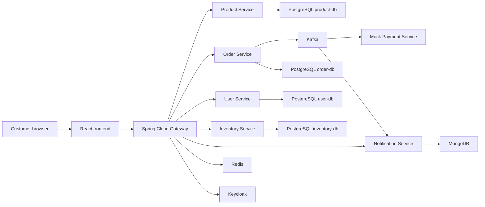
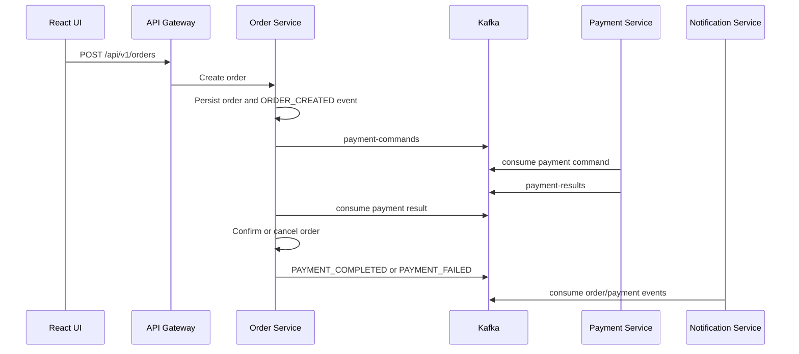

# TechShop Architecture

## System Context

## Bounded Contexts

- Product Catalog owns product identity, categorization, pricing, reviews, and search projections.
- Ordering owns carts converted to orders, order items, status transitions, and order event history.
- Inventory owns sellable quantity, reservation, release, restock, and low-stock policy.
- Identity owns users, roles, profiles, token issuance, refresh, and social identity provider mapping.
- Notification owns customer-facing messages for order, payment, shipping, and restock events.
- Payment owns gateway interaction and publishes payment outcomes back to Ordering.

## Critical Flow: Place Order

## Deployment

Local development uses the root `docker-compose.yml`. Kubernetes deployment artifacts live in `infrastructure/kubernetes` and include namespace, secrets, configmaps, stateful services, stateless services, ingress, and HPA.

## Production Security Notes

- Keycloak realm import lives in `infrastructure/keycloak/techshop-realm.json`.
- Social login providers are declared but disabled until provider client IDs and secrets are supplied.
- Kubernetes secrets are represented as development placeholders; production deployments should replace them with sealed secrets, External Secrets Operator, or Vault.
- Ingress is configured for TLS; a real cluster must provide `techshop-tls`.
